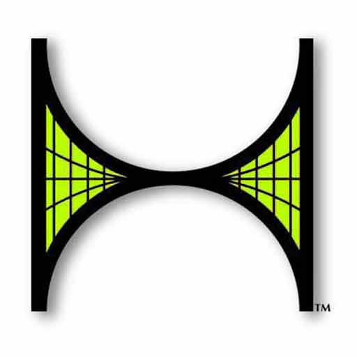
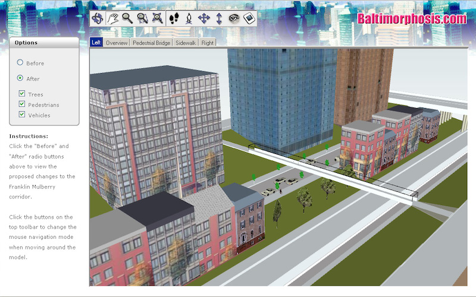
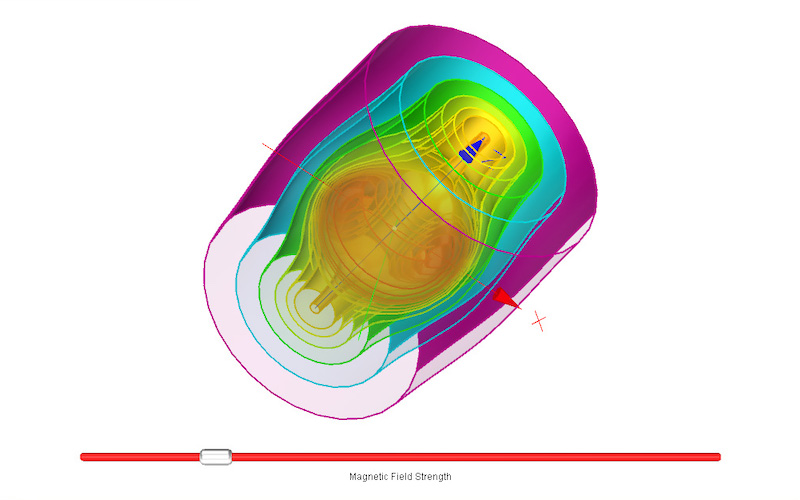
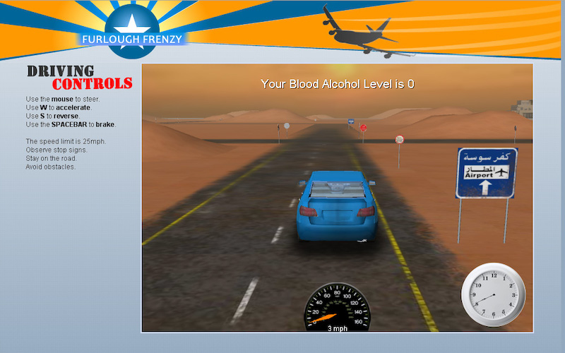
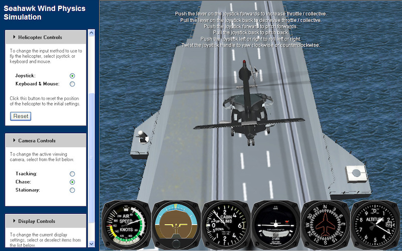
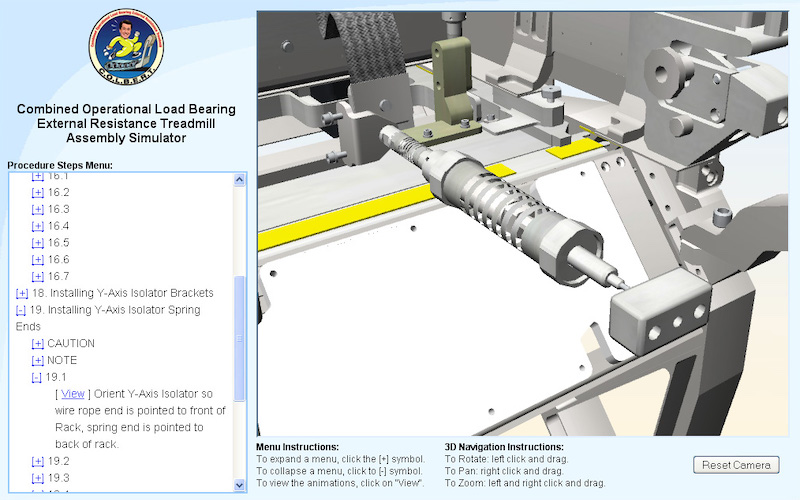
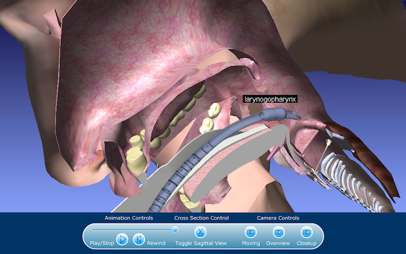

  

    
  

# Hypercosm

Hypercosm was a web based 3D simulation and rendering platform based upon a high level scripting language called "OMAR" for Object Oriented Modeling Animation and Rendering.   It was used between 1997 and 2012 for creating web based simulations for a variety of applications.  

# Applications

The Hypercosm software was used for a  variety of applications over the years including:

### Architectural visualization

Hypercosm had a very nice set of translators from 3ds Max and SketchUp which made it attractive for use in architectural visualization.

 

### Scientific visualization

Hypercosm was used for scientific visualization and several dozen Hypercosm simulations were published by the New York Times to illustrate news about science and space.

 

### Games

The software was used to create microgames for fun and for the US Army.

 

### Aerospace training

The software was used for various forms of aerospace training including maintenance trainers and helicopter flight simulators with weather effects.

 

### NASA crew training

Hypercosm was used by NASA for astronaut crew training.  This training included science payloads, robotic arm operation, and an interactive assembly manual for the treadmill that is currently on the International Space Station.

 

### Medical visualization

Hypercosm was used for some forms of medical and medical device simulation.

 

# History

Hypercosm was first developed by Abe Megahed and Mark Spychalla in the mid 1990s.  It became a dot com era company called Hypercosm Inc. which tried to make a go of it promoting 3D simulation based instruction and training.  The Hypercosm technology was acquired by Orbital Technologies in 2000 and proceeded to spend the next 12 years developing simulations largely for NASA and the department of Defense.  Hypercosm LLC ceased operations in 2012. 

# The Software Status

The Hypercosm software and its associated translators (from 3DS Max and SketchUp) was acquired / taken over by Sierra Nevada Aerospace and has been lost.  In addition, web browser plugins have been removed from web browsers by the tech giants so it is no longer possible for anyone outside of these companies to expand upon the browser's capabilities.  Hypercosm became a victim of a corporate merger and technologies like it have been effectively killed off by Big Tech so as a result, the software is now effectively dead. 

# Intended Usage

Although the original Hypercosm software is dead and it is no longer possible to run Hypercosm in its full glory inside of a web browser, it is still possible to run OMAR scripts from the command line.   The code included here is provided here as an instructive example of the capabilities and architecture of the system.  The software had many attractive characteristics which are still unique today so this software is provided in hope that it can provide a model and inspiration to future simulation  software developers. 

<!-- Contents -->

# Contents

This repository contains the following:

### Includes (The API)

This is a collection of .ores (OMAR Resources) files which formed the basis of the Hypercosm API.  The Hypercosm system was built on top of an interpreted scripting language so much of the higher level API and infrastructure was built in this OMAR language rather than in the C language which was used for the low level graphics engine and interpreter.

### Examples

This includes a collection of projects and example scripts that illustrate the use of the Hypercosm API.  The examples are divided up into "Scripts" which are simple standalone scripts and "Projects" which contain scripts along with additional resources such as images and sounds. 

### Dephi Hypercosm

This is a version of the OMAR language compiler and interpreter and the Hypercosm renderer that is separate from the original (C language) code base and can be run from the command line.   

<!-- LICENSE -->

# License

Distributed under the MIT license which allows urestricted use of the software. See [LICENSE.txt](LICENSE.txt) for more information.

<!-- CONTACT -->

# Contact

Abe Megahed - (mailto:amegahed@wisc.edu) - email